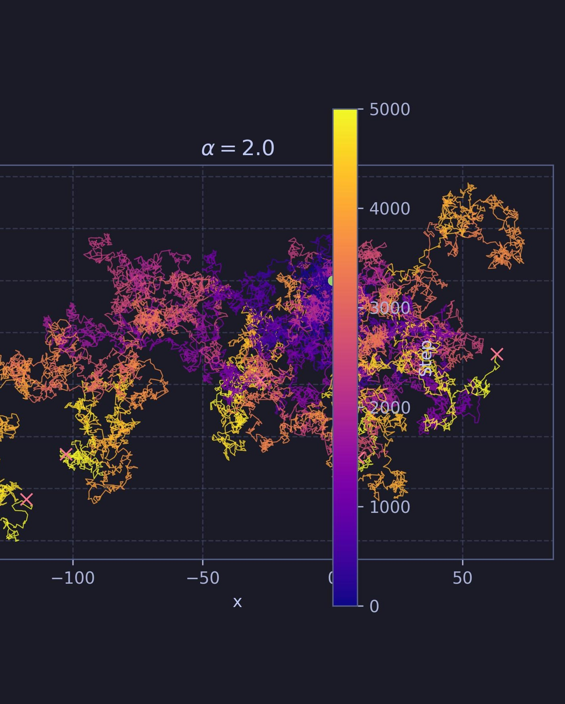
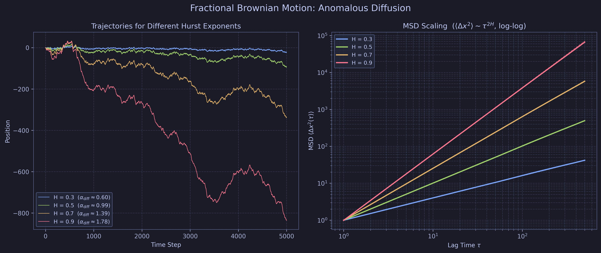
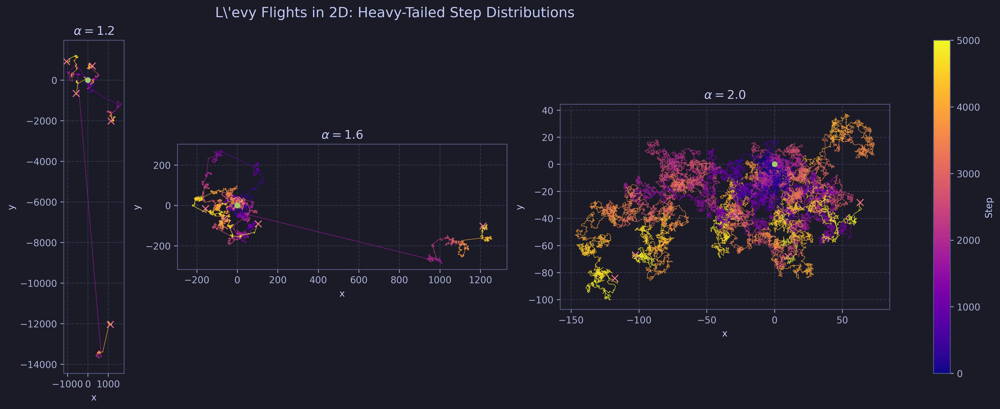
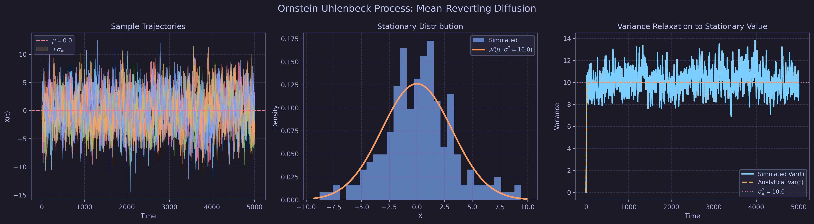
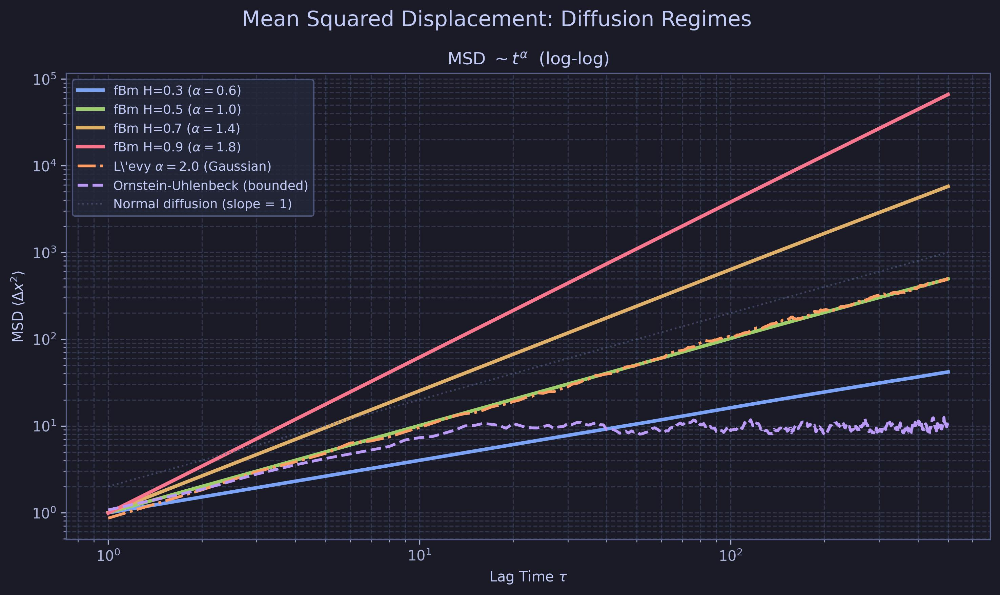

# Brownian Motion

[](https://github.com/IsolatedSingularity/Brownian-Motion/actions/workflows/ci.yml)
[](https://www.python.org/)
[](https://numpy.org/)
[](https://scipy.org/)
[](https://matplotlib.org/)

<p align="center">
  
</p>

Two complementary scripts exploring random walks and their generalizations, from the textbook 1D random walk to the menagerie of anomalous diffusion processes found in physics, biology, and finance.

---

## Files

### `Brownian Motion; Random Walks.py`

A 1D random walk with two step-size classes: 7 unit steps and 1 jump of size 3 per macro-step, repeated for 10,000 macro-steps. The simulation tracks the walker's position $x(t)$ and the cumulative mean-squared displacement, then fits two theoretical curves to $x_\text{RMS}(t)$:

- **Angela fit**: $x_\text{RMS} = \sqrt{2(D + \varepsilon)\, t}$, a diffusion constant shifted by $\varepsilon$
- **Donald fit**: $x_\text{RMS} = \sqrt{2D}\, t^{1/2 + \delta}$, an anomalous-diffusion power law

Goodness-of-fit is assessed with a $\chi^2$ test against each model. The resulting plot overlays the raw trajectory, the RMS curve, and both fits on a single panel.

### `Generalizations; Anomalous Diffusion & Levy Flights.py`

Extends the random-walk picture to four distinct diffusion regimes, all visualised with the Tokyo Night Storm dark palette:

| Process | Key parameter | Diffusion regime |
|---------|--------------|-----------------|
| Fractional Brownian motion (fBm) | Hurst exponent $H \in (0, 1)$ | Sub-diffusive ($H < 0.5$), normal ($H = 0.5$), super-diffusive ($H > 0.5$) |
| Lévy flights | Stability index $\alpha \in (0, 2]$ | Ballistic jumps, infinite variance for $\alpha < 2$ |
| Ornstein-Uhlenbeck | Mean-reversion rate $\theta$, noise $\sigma$ | Bounded; variance saturates at $\sigma^2 / 2\theta$ |
| MSD comparison | All of the above | Log-log MSD scaling $\langle \Delta x^2 \rangle \sim t^\alpha$ |

fBm trajectories are generated via the exact Davies-Harte spectral method. Lévy steps are drawn from a symmetric stable distribution using `scipy.stats.levy_stable`. The OU process uses exact Euler-Maruyama discretisation with analytical variance $\text{Var}(t) = \frac{\sigma^2}{2\theta}(1 - e^{-2\theta t})$ plotted alongside the simulated ensemble.

Output figures (saved to `Plots/`):

- `fBm_anomalous_diffusion.jpg`: trajectories + MSD power-law scaling for $H \in \{0.3, 0.5, 0.7, 0.9\}$
- `levy_flights_2d.jpg`: 2D Lévy flight paths colored by step progression, three stability indices
- `ornstein_uhlenbeck.jpg`: OU sample paths, stationary Gaussian distribution, variance relaxation
- `msd_comparison.jpg`: unified log-log MSD comparison across all regimes

<p align="center">
  
</p>

<p align="center">
  
</p>

<p align="center">
  
</p>

<p align="center">
  
</p>

---

## Theory

### Standard Brownian Motion

For a walker taking steps of size $\pm 1$ with equal probability, the central limit theorem gives $x_\text{RMS}(t) = \sqrt{2Dt}$ with diffusion constant $D = \sigma^2 / 2$ where $\sigma^2$ is the step-size variance.

### Anomalous Diffusion

The generalized MSD scaling $\langle \Delta x^2 \rangle \sim t^\alpha$ classifies diffusion regimes:

$$\alpha < 1: \text{ subdiffusion} \quad \alpha = 1: \text{ normal} \quad \alpha > 1: \text{ superdiffusion}$$

For fBm with Hurst exponent $H$, $\alpha = 2H$. The autocovariance of the increments (fractional Gaussian noise) is:

$$\gamma(k) = \tfrac{1}{2}\bigl(|k+1|^{2H} - 2|k|^{2H} + |k-1|^{2H}\bigr)$$

which is negative for $H < 0.5$ (anti-persistent, subdiffusive) and positive for $H > 0.5$ (persistent, superdiffusive).

### Lévy Flights

For step-size distributions with power-law tails $P(x) \sim |x|^{-(1+\alpha)}$, $\alpha \in (0, 2)$, the variance diverges and the central limit theorem is replaced by the generalized stable-law limit theorem. The characteristic function is $\hat{P}(k) = e^{-|k|^\alpha}$.

### Ornstein-Uhlenbeck Process

The OU process solves the Langevin equation:

$$dX = -\theta(X - \mu)\,dt + \sigma\,dW$$

yielding a Gaussian stationary distribution $\mathcal{N}(\mu,\, \sigma^2/2\theta)$. Unlike free Brownian motion, the variance saturates rather than growing without bound, making OU a canonical model for mean-reverting fluctuations (interest rates, velocity in a fluid, thermal noise in a harmonic trap).

---

## Setup

```bash
pip install numpy scipy matplotlib cycler
python "Brownian Motion; Random Walks.py"
python "Generalizations; Anomalous Diffusion & Levy Flights.py"
```

Plots are written to `Plots/` (created automatically if absent).

